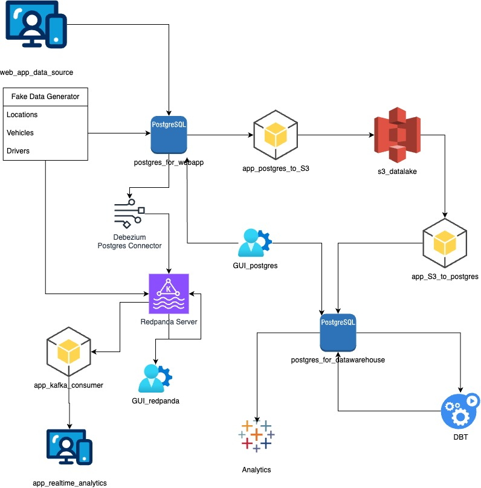

# Data Pipeline Docker Compose Documentation

# Architecture Diagram



## Services Overview

1. **pgadmin**: GUI for managing PostgreSQL databases.
2. **postgres_for_webapp**: PostgreSQL database server for the web applications
3. **webapp**: Web application for collecting data and storing it in the `postgres_for_webapp` database. 
4. **landing_zone_s3**: S3 bucket acting as a long term landing zone for raw data files.
5. **app_postgres_to_s3**: Lambda function to load data from applications' Postgres to S3.
6. **app_s3_to_postgres**: Lambda function to load data from S3 to datawarehouse Postgres
7. **postgres_for_datawarehouse**: Postgres database server for the enterprise data warehouse.
8. **redpanda_console**: GUI for Redpanda streaming platform.
9. **redpanda_server**: Redpanda server, a Kafka-compatible streaming service.
10. **redpanda-init**: Initializes the Redpanda server, creates a topic, and exits.
11. **debezium**: Debezium configures connectors for streaming changes from Postgres or various sources to Kafka compatible streaming services, such as Redpanda.
12. **debezium_ui**: GUI for monitoring Debezium connectors.
13. **debezium-init**: Initializes the Debezium and configures the postgres connector and then exits.
14. **app_data_generator**: Generates fake data and posts it to PostgreSQL and Redpanda.
15. **app_realtime_location**: Represents a Web application for realtime analytics

## How to Use

1. Ensure you have Docker and Docker Compose installed on your system.
2. Clone this repository to your local machine.
3. Navigate to the root directory of the cloned repository.
4. Run the following command to start the services:

   ```
   docker-compose up -d
   ```

   This will start all the services defined in the Docker Compose file in detached mode.

5. Access the services as follows:

   - **pgadmin**: http://localhost:5050
   - **Redpanda Console**: http://localhost:8080
   - **Debezium UI**: http://localhost:8081
   - **Web App**: http://localhost:5001
   - **Minio S3 Console**: http://localhost:9000
   - **Realtime Location Dashboard**: http://localhost:18050


   - **For Passwords and Credentials**: Refer to the docker compose yml file

6. To stop the services, run:

   ```
   docker-compose down
   ```
 
7. Open docker desktop and inspect the network IP address of the container named  `storage_landing_zone_s3`
5. Open the `docker-compose.yml` file in your text editor and search for `- AWS_END_POINT=`
6. Replace the endpoint IP address with the IP address of the `storage_landing_zone_s3` service ` ex: AWS_END_POINT=http://172.29.0.7:9000`. For some reason, docker can't resolve the DNS for the `minIO` service with the service name.
7. If you delete the folders that start with `data_` you will need to go to the `minIO console` at `http://localhost:9001/access-keys` and create new access keys. Then you need to update the `AWS_SECRET_ACCESS_KEY`,  `AWS_ACCESS_KEY_ID`, and `AWS_REGION` environmental variables in the docker-compose file with the new ones.

## Configuration

- **Environment Variables**: You can customize environment variables in the `docker-compose.yml` file to configure database credentials, S3 bucket settings, Kafka brokers, etc.
- **Volumes**: Persistent data volumes are used to store database data, pgadmin configurations, S3 data, etc.
- **Networks**: The services are connected to a custom bridge network named `app_network`.


## Services Details


1. **pgadmin**: GUI for managing PostgreSQL databases.


2. **postgres_for_webapp**: PostgreSQL database server for the web application's data warehouse.
3. **webapp**: Web application for collecting data and storing it in the `postgres_for_webapp` database.
4. **landing_zone_s3**: S3 bucket acting as a landing zone for raw data files.
5. **app_postgres_to_s3**: Lambda function to load data from PostgreSQL to S3.
6. **app_s3_to_postgres**: Lambda function to load data from S3 to PostgreSQL.
7. **postgres_for_datawarehouse**: PostgreSQL database server for the enterprise data warehouse.
8. **redpanda_console**: GUI for Redpanda streaming platform.
9. **redpanda_server**: Redpanda server, a Kafka-compatible streaming service.
10. **redpanda-init**: Initializes the Redpanda server and creates a topic.
11. **debezium**: Debezium connector for streaming changes from PostgreSQL to Kafka.
12. **debezium_ui**: GUI for monitoring Debezium connectors.
13. **debezium-init**: Initializes the Debezium connector.
14. **app_data_generator**: Generates data and posts it to PostgreSQL and Kafka.
15. **app_realtime_location**: Web application for collecting real-time location data.